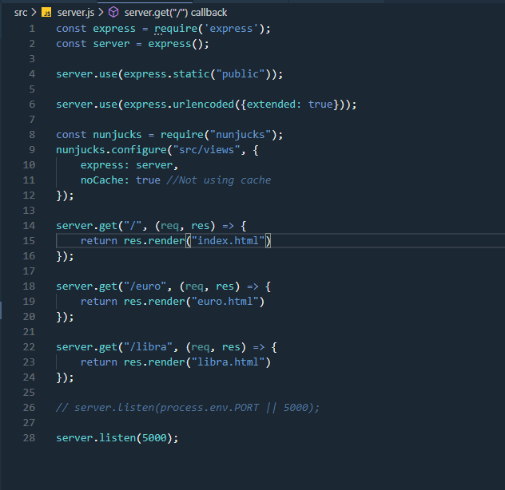
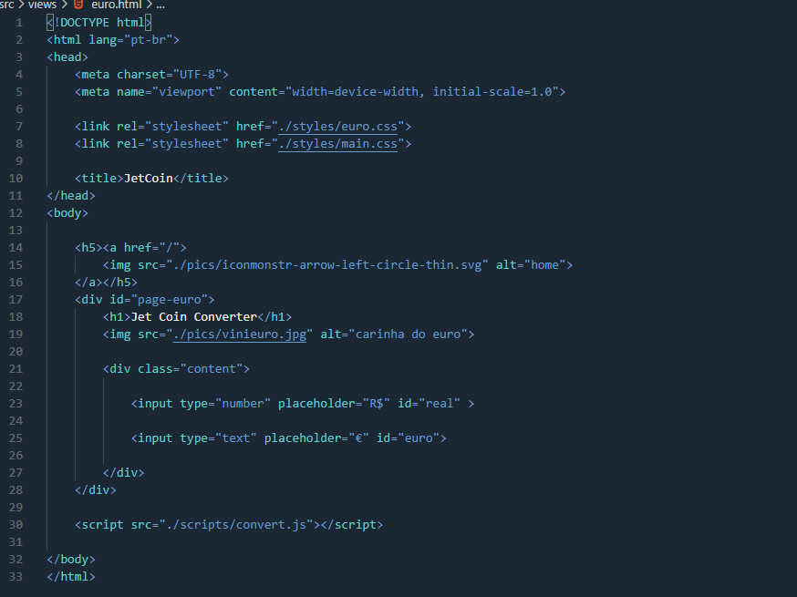

# Z-Theme for Visual Studio Code

## How to install

```js
1 - Open the extensions sidebar on Visual Studio Code

2 - Search for Z Theme or Z-Theme

3 - Click Install

4 - Click Reload to reload your editor

5 - Select the Manage Cog (bottom left) > Color Theme ＞ Z theme

🌟🌟🌟🌟🌟 Rate five-stars 😃
```

Feel free to clone and make some changes if u want!

## Cloning

Go to my repository and be happy [Repo](https://github.com/EduardoZortea18/Z-Theme).

## Images

This is how your IDE will look like.






